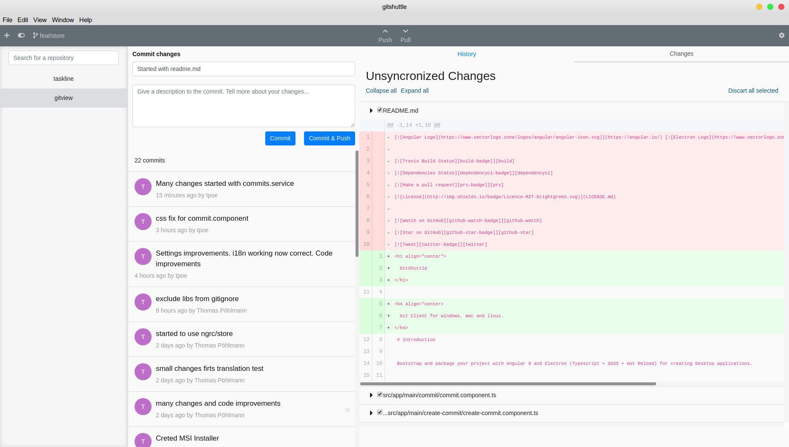

<h1 align="center">
  GitShuttle
</h1>

<h4 align="center">
  Git Client for windows, mac and linux.
</h4>

<div align="center">
  
</div>

## Description

By utilizing a simple and minimal ui, that requires a flat learning curve, GitShuttle enables you to effectivly manage your repositories. GitShuttle is available for a windows, max and linux. 

Come over to [Gitter](https://gitter.im/gitshuttle/community#) or [Twitter](https://twitter.com/perryrh0dan1) to share your thoughts on the project.

## Features

### Actual
- Selection of a git repository on your machine
- Create Commit
- Push and Pull functionality
- Fast switch between multiple repositories
- Change inspection
- View commit history

### Coming
- Branch selection
- Functionality to directly clone repositories with GitShuttle
- Ui Improvements
- Github and Gitlab support to display issues and more in GitShuttle
- Much more...

## Contents

* [Description](#description)
* [Features](#features)
* [Install](#install)
* [Usage](#usage)
* [Configuration](#configuration)
* [Before Flight](#before-flight)
* [Flight Manual](#flight-manual)
* [Development](#development)
* [Team](#team)
* [License](#license)

## Development

For more information on how to contribute to the project, please read the [contributin guidelines](https://github.com/perryrh0dan/gitshuttle/blob/master/contributing.md).

### Introduction

This project is builded with with Angular 8 and Electron.

Currently runs with:
- Angular v8.1.3
- Electron v6.0.2
- Electron Builder v21.2.0

### Getting Started

Clone this repository locally :

``` bash
git clone https://github.com/perryrh0dan/gitshuttle.git
```

Install dependencies with npm :

``` bash
npm install
```

There is an issue with `yarn` and `node_modules` that are only used in electron on the backend when the application is built by the packager. Please use `npm` as dependencies manager.


If you want to generate Angular components with Angular-cli , you **MUST** install `@angular/cli` in npm global context.
Please follow [Angular-cli documentation](https://github.com/angular/angular-cli) if you had installed a previous version of `angular-cli`.

``` bash
npm install -g @angular/cli
```

### To build for development

- **in a terminal window** -> npm start

Voila! GitShuttle runs in a local development environment with hot reload!

## Included Commands

|Command|Description|
|--|--|
|`npm run ng:serve:web`| Execute the app in the browser |
|`npm run build`| Build the app. Your built files are in the /dist folder. |
|`npm run build:prod`| Build the app with Angular aot. Your built files are in the /dist folder. |
|`npm run electron:local`| Builds your application and start electron
|`npm run electron:linux`| Builds your application and creates an app consumable on linux system |
|`npm run electron:windows`| On a Windows OS, builds your application and creates an app consumable in windows 32/64 bit systems |
|`npm run electron:mac`|  On a MAC OS, builds your application and generates a `.app` file of your application that can be run on Mac |
